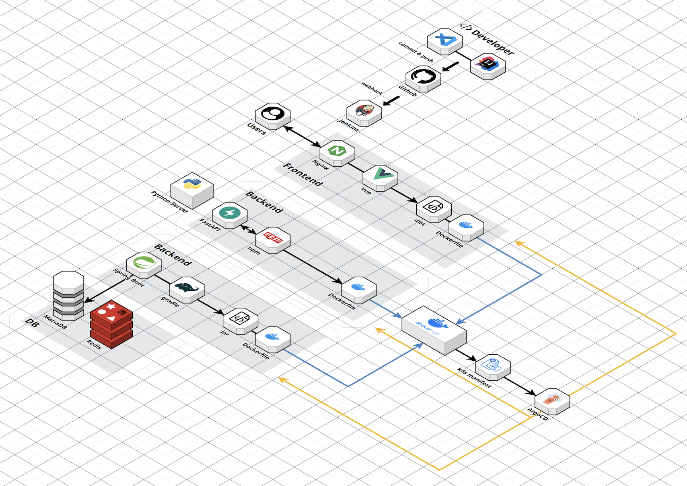

<p align="center">
  
</p>

# CI/CD 발표자료
https://docs.google.com/presentation/d/1qshOqG2RWEBWa9YqodJfumGWBgeQHwxH4nFSYmgzR4k/edit?usp=sharing

## 👥팀원  

| 서현원 | 김택곤 | 육세윤 | 이인화 | 김대의 |
| :---: | :---: | :---: | :---: | :---: |
|   |   |    |   |   |
|<a href="https://github.com/viroovr" target="_blank"></a> | <a href="https://github.com/dobbyRR" target="_blank"></a> | <a href="https://github.com/KorSwib" target="_blank"></a> | <a href="https://github.com/Inhwa1003" target="_blank"></a> | <a href="https://github.com/kimeodml" target="_blank"></a> | 

## 📚 목차

1. [프로젝트 개요](#1-프로젝트-개요)  
2. [요구사항 명세서](#2-요구사항-명세서)  
3. [기술 스택](#3-기술-스택)  
4. [시스템 아키텍처](#4-시스템-아키텍처)  
5. [데이터베이스 설계 (ERD)](#5-데이터베이스-설계-erd)  
6. [테이블 명세서](#6-테이블-명세서)  
7. [API 명세서](#7-api-명세서)  
8. [테스트 결과서](#8-테스트-결과서)
9. [CI/CD 절차](#9-CI/CD-절차)
10. [향후 개선 계획](#10-향후-개선-계획)  
11. [회고록](#11-회고록)

<br/>


## <a id="1-프로젝트-개요"></a> 1. 프로젝트 개요  
#### 1.1 프로젝트 소개
**SpecGuard**는 기업의 인사 담당자가 이력서 및 포트폴리오의 정합성을 자동으로 검사하고, 신뢰도 있는 채용 결정을 지원하는 B2B SaaS 플랫폼입니다.

- 지원자는 **폼 기반**으로 이력 정보를 입력
- 시스템은 자동으로 **내용 요약, 키워드 추출, 일치율 점수 계산**
- 기업은 신뢰성 높은 지원자 평가를 통해 **채용 리스크 최소화**

#### 1.2 프로젝트 배경
- **허위/과장 기재로 인한 검증 리스크**  
    일부 지원자는 실제로 보유하지 않은 기술을 이력서에 기재하거나, 형식적으로만 구성된 포트폴리오를 첨부하는 사례가 존재합니다.
    이는 채용 후 업무 적응 실패, 기업 평판 저하 등의 문제로 이어질 수 있습니다.

- **포트폴리오 정보의 비표준화 문제**  
    다양한 형태의 포트폴리오(개인 블로그, 깃허브, 노션 등)가 존재하므로, 이를 일관된 기준으로 평가하기 어렵습니다.

- **검증 피로도 및 시간 낭비**  
    수많은 이력서를 검토하는 HR 담당자나 실무진은, 포트폴리오나 자격 정보를 하나씩 확인하는 데 많은 시간을 소모하며, 그 과정에서 중요한 핵심 역량을 놓치기도 합니다.  
  
(출처 : https://www.ohmynews.com/NWS_Web/View/at_pg.aspx?CNTN_CD=A0003053666)    
<br><br>

(출처:https://www.hankyung.com/article/202507224138i)

<br/>

<br/>

## 2. 요구사항 명세서

### 기능 요구사항

#### 2.1 요약

| 요구사항 ID | 대분류 | 중분류 | 소분류 | 상세 설명 | 중요도 |
|-------------|--------|--------|--------|-----------|--------|
| FR-01 | 이력서 제출 | 폼 입력 | 기본 정보 입력 | 지원자가 이름, 연락처, 학력 등을 입력 | ★★★ |
| FR-02 | 정합성 분석 | Gemini 활용 | 요약 | 자기소개서 요약 생성 (3~5문장) | ★★☆ |
| FR-03 | 정합성 분석 | Cos 유사도 계산 |일치율 판단 | 자소서 vs 포트폴리오 간 유사도 측정 | ★★★ |
| FR-04 | 크롤링 | URL |포트폴리오 수집 | Notion, Velog 등 외부 포트폴리오 수집 | ★★☆ |
| FR-05 | 검증 리포트 | PDF 형식 |검증 결과 제공 | 검증 점수 및 사유 포함 리포트 자동 생성 | ★★★ |

#### 2.2 전문
<details>
<summary>요구사항 명세서 링크</summary>
<div markdown="1">
  
[요구사항 명세서](https://docs.google.com/spreadsheets/d/1_VCJofMDKv3oDyNVuIkYaGBFm2pezy_r_WRvxPwOQ-A/edit?gid=1380067657#gid=1380067657)

</div>
</details>

<br/>


## 3. 기술 스택


#**Frontend**
<br>


#**Backend**
<br>


#**Crawler**
<br>


#**NLP 분석**
<br>


#**Database**
<br>


#**API Platform**
<br>


#**Tools&External References**
<br>


  <a href="https://www.erdcloud.com" target="_blank">  </a>

#**CI/CD**
<br>


<br/>

## 4. 시스템 아키텍처



<br/>


## 5. 데이터베이스 설계 (ERD)

### ERD
[ERD CLOUD](https://www.erdcloud.com/d/jAJ6DJnaAkz2GKoJX)
<details>
  


</details>
<br>


## 6. 테이블 명세서

[테이블 명세서](https://docs.google.com/spreadsheets/d/1rohN4_s3YLDfYMuYjYqJgqTp1kEWab0ajzBy4B2j8YY/edit?usp=sharing)


<br>

## 7. API 명세서

[API 명세서](https://www.notion.so/API-2455605940ec80d0a6cecfb101029e19?source=copy_link)

<br/>


## 8. 테스트 결과서

[백엔드 테스트 결과서](https://www.notion.so/2775605940ec801286d6f888af3e93d2?v=2775605940ec80ba931c000c1fcfe3ed)

[단위 테스트 결과서](https://www.notion.so/292819b5e8c680959006d4e288e86acd?source=copy_link)


<br>

## 9. CI/CD 절차
### 9-1. 개요 <br>
프로젝트명: SpecGuard <br>
프로젝트 유형: 이력서·경력 자동검증 서비스 (Spring Boot + MariaDB + Docker 기반)<br>
DevOps 목표: 코드 배포 자동화, 안정적 버전관리, 서비스 무중단 운영
<br>
### 9-2. 기술 스택 및 선택 이유
   
| **구분**           | **기술**               | **선택 이유**                                                                                                                                   |
| ---------------- | -------------------- | ------------------------------------------------------------------------------------------------------------------------------------------- |
| **컨테이너 오케스트레이션** | **Kubernetes (k8s)** | - Docker 컨테이너의 자동 배포 및 스케일링<br>- Pod 단위 격리로 서비스 안정성 확보<br>- 무중단 롤링 업데이트 및 헬스체크 지원                     |
| **CI 서버**        | **Jenkins**          | - 오픈소스 CI 툴로 커스터마이징 용이<br>- Spring Boot, Gradle, Docker와 높은 호환성<br>- 파이프라인 스크립트를 통한 유연한 빌드/테스트 자동화<br>- GitHub Webhook 기반 자동 빌드 트리거 가능      |
| **CD 툴**         | **ArgoCD**           | - GitOps 방식의 CD 지원 (Git 상태 = 실제 배포 상태)<br>- k8s 리소스 변경 자동 감지 및 동기화<br>- UI를 통한 배포 상태 모니터링 및 롤백 지원<br>- Jenkins와의 연동으로 배포 승인/자동화 파이프라인 구성 가능 |


### 9-3. CI/CD 파이프라인 절차

#### (1) CI 단계 (Continuous Integration) – Jenkins

1. 개발자가 코드 푸시 → GitHub Webhook Trigger  
 - develop, main 브랜치 기준으로 자동 감지

2. Jenkins Pipeline 실행  
 - Jenkinsfile 스크립트 기반  
 - Gradle 빌드 및 단위 테스트 수행  
     `./gradlew clean build`

3. 도커 이미지 생성  
 - DockerFile 기반 이미지 빌드  
 - 이미지 태그:  
     - java 서버: `viroovr/specguard-api:(jenkins job id)`  
     - python 서버: `viroovr/specguard-nlp:(jenkins job id)`  
     - frontend 서버: `kimeodml/specguard-frontend:(jenkins build no)`

4. 도커 허브 푸시  
 - Jenkins Credential을 이용해 DockerHub로 이미지 업로드

```groovy
stage('Build & Push') {
    sh 'docker build -t viroovr/specguard-api:${GIT_COMMIT} .'
    sh 'docker push viroovr/specguard-api:${GIT_COMMIT}'

    sh 'docker build -t viroovr/specguard-nlp:${GIT_COMMIT} .'
    sh 'docker push viroovr/specguard-nlp:${GIT_COMMIT}'

    sh 'docker build -t kimeodml/specguard-frontend:${GIT_COMMIT} .'
    sh 'docker push kimeodml/specguard-frontend:${GIT_COMMIT}'
}
```
#### (2) CD 단계 (Continuous Deployment) – ArgoCD + Kubernetes <br>
1. **ArgoCD가 GitOps Repository 모니터링**
 - GitHub Repository: [specguard-k8s-manifests](https://github.com/kimeodml/specguard-k8s-manifests)
 - 모니터링 디렉토리 구조:
     ```
     specguard-k8s-manifests/
     ├── specguard-backend/
     │   ├── java/
     │   └── python/
     └── specguard-frontend/
     ```
 - 각 서비스별로 Deployment, Service, Ingress 매니페스트 관리
 - ArgoCD는 각 디렉토리를 개별 Application으로 등록하여 자동 동기화

2. 새로운 이미지 태그 감지 시 자동 배포 <br>
  - ArgoCD가 k8s 클러스터에 배포 상태를 동기화 <br>
  - Deployment의 image 필드 변경 감지 → Rolling Update 수행 <br>
3. 배포 검증 및 롤백 <br>
  - ArgoCD UI에서 Pod 상태, Sync 상태 확인 <br>
  - 실패 시 이전 리비전으로 원클릭 롤백 가능 <br>
4. Argo CD 레포

<details>
<summary>Argo CD 레포 링크</summary>

[Argo CD 레포 바로가기](https://www.notion.so/CI-CD-292819b5e8c680c78d53fa140f580c25?d=292819b5e8c680dcb63d001c63e194ce&source=copy_link#9aa5f72c33064e0489dba5b6c44849ae)

</details>


### 9-4. 장단점 분석

| **구분**         | **장점**                                                             | **단점**                                        |
| -------------- | ------------------------------------------------------------------ | --------------------------------------------- |
| **Kubernetes** | - 자동 복구(Self-healing)<br>- 무중단 배포(Rolling Update)<br>- 클라우드 친화적 구조 | - 초기 세팅 복잡<br>- YAML 관리량 많음                   |
| **Jenkins**    | - 플러그인 다양성<br>- 완전한 빌드 자동화<br>- Webhook 실시간 트리거 가능                 | - UI/구성 복잡<br>- 별도 관리 서버 필요                   |
| **ArgoCD**     | - GitOps 기반 선언적 배포<br>- 롤백 용이<br>- 실시간 배포 모니터링                     | - 초기 설정 난이도 높음<br>- Git 상태와 실제 배포 불일치 시 혼란 가능 |

### 9-5. 전체 아키텍처 흐름 <br>
  [개발자] → GitHub → Jenkins (CI) <br>
  → Docker Build & Push → GitOps Repo 업데이트 <br>
  → ArgoCD (CD) → Kubernetes Cluster 배포
<br>
  CI/CD 흐름 요약: <br>
  - Git Push 시 자동 빌드 → 이미지 생성/업로드 → k8s 매니페스트 반영 → 자동 배포/모니터링

### 9-6. 결론 <br>
  본 CI/CD 구조는 개발-테스트-배포의 전 과정을 자동화하여 <br>
    - 배포시간 단축, 버전 추적성 강화, 장애 발생 시 빠른 롤백 을 가능하게 한다.

    
<br>


## 10. 향후 개선 계획

1. 분석 정확도 개선을 위한 모델 업그레이드

2. 적절한 에러처리

3. 통계 및 리포트 페이지 구현

<br/>

## 11. 회고록
|   이 름  | 내용 |
|--------|--------|
| 서현원 | CI/CD 개발에 대해 평소 궁금증이 많았고 직접 경험해보고 싶은 마음이 컸습니다. 이번 프로젝트에서 팀원들과 함께 파이프라인을 개발하며 이러한 궁금증을 직접 해결할 수 있었고, 현업에서의 CI/CD 전체 흐름을 큰 그림으로 이해할 수 있었습니다. 덕분에 앞으로 DevOps 엔지니어들과 원활히 소통하거나, 필요시 직접 DevOps 업무를 수행할 자신감이 생겼습니다. 또한 Docker와 Kubernetes를 활용한 환경 구축과 운영에도 적극적으로 적용할 수 있는 역량을 키울 수 있었습니다.  |
| 김대의 |  |
| 김택곤 |  |
| 육세윤 | 이번 CI/CD 프로젝트를 통해 코드 변경이 자동으로 빌드·배포되는 파이프라인의 중요성과 효율성을 깊이 체감했다. 지속적 통합과 배포를 직접 구현하며 개발 생산성과 협업 안정성을 동시에 확보하는 DevOps를 배울 수 있는 귀중한 기회였다.   |
| 이인화 | Jenkins 파이프라인을 구성하면서 빌드 단계와 배포 단계가 어떤 순서로 진행되는지, 또 ArgoCD가 어떻게 실제 클러스터 상태를 지속적으로 모니터링하고 동기화하는지 확인할 수 있었습니다. 이 과정을 통해 자동화의 핵심은 단순히 시간을 줄이는 것이 아니라 안정적이고 일관된 배포 흐름을 만드는 것이라는 점을 배웠습니다. |
