<p align="center">
  
</p>


## 👥팀원  

| 서현원 | 김택곤 | 육세윤 | 이인화 | 김대의 |
| :---: | :---: | :---: | :---: | :---: |
|   |   |    |   |   |
|<a href="https://github.com/viroovr" target="_blank"></a> | <a href="https://github.com/dobbyRR" target="_blank"></a> | <a href="https://github.com/KorSwib" target="_blank"></a> | <a href="https://github.com/Inhwa1003" target="_blank"></a> | <a href="https://github.com/kimeodml" target="_blank"></a> | 


### CI/CD 발표자료
[발표자료](https://docs.google.com/presentation/d/1qshOqG2RWEBWa9YqodJfumGWBgeQHwxH4nFSYmgzR4k/edit?usp=sharing)

## 📚 목차

1. [프로젝트 개요](#1-프로젝트-개요)  
2. [요구사항 명세서](#2-요구사항-명세서)  
3. [기술 스택](#3-기술-스택)  
4. [시스템 아키텍처](#4-시스템-아키텍처)  
5. [데이터베이스 설계 (ERD)](#5-데이터베이스-설계-erd)  
6. [테이블 명세서](#6-테이블-명세서)  
7. [API 명세서](#7-api-명세서)  
8. [테스트 결과서](#8-테스트-결과서)
9. [CI/CD 절차](#9-CI/CD-절차)
10. [향후 개선 계획](#10-향후-개선-계획)  
11. [회고록](#11-회고록)

<br/>


## <a id="1-프로젝트-개요"></a> 1. 프로젝트 개요  
#### 1.1 프로젝트 소개
**SpecGuard**는 기업의 인사 담당자가 이력서 및 포트폴리오의 정합성을 자동으로 검사하고, 신뢰도 있는 채용 결정을 지원하는 B2B SaaS 플랫폼입니다.

- 지원자는 **폼 기반**으로 이력 정보를 입력
- 시스템은 자동으로 **내용 요약, 키워드 추출, 일치율 점수 계산**
- 기업은 신뢰성 높은 지원자 평가를 통해 **채용 리스크 최소화**

#### 1.2 프로젝트 배경
- **허위/과장 기재로 인한 검증 리스크**  
    일부 지원자는 실제로 보유하지 않은 기술을 이력서에 기재하거나, 형식적으로만 구성된 포트폴리오를 첨부하는 사례가 존재합니다.
    이는 채용 후 업무 적응 실패, 기업 평판 저하 등의 문제로 이어질 수 있습니다.

- **포트폴리오 정보의 비표준화 문제**  
    다양한 형태의 포트폴리오(개인 블로그, 깃허브, 노션 등)가 존재하므로, 이를 일관된 기준으로 평가하기 어렵습니다.

- **검증 피로도 및 시간 낭비**  
    수많은 이력서를 검토하는 HR 담당자나 실무진은, 포트폴리오나 자격 정보를 하나씩 확인하는 데 많은 시간을 소모하며, 그 과정에서 중요한 핵심 역량을 놓치기도 합니다.  
  
(출처 : https://www.ohmynews.com/NWS_Web/View/at_pg.aspx?CNTN_CD=A0003053666)    
<br><br>

(출처:https://www.hankyung.com/article/202507224138i)

<br/>

<br/>

## 2. 요구사항 명세서

### 기능 요구사항

#### 2.1 요약

| 요구사항 ID | 대분류 | 중분류 | 소분류 | 상세 설명 | 중요도 |
|-------------|--------|--------|--------|-----------|--------|
| FR-01 | 이력서 제출 | 폼 입력 | 기본 정보 입력 | 지원자가 이름, 연락처, 학력 등을 입력 | ★★★ |
| FR-02 | 정합성 분석 | Gemini 활용 | 요약 | 자기소개서 요약 생성 (3~5문장) | ★★☆ |
| FR-03 | 정합성 분석 | Cos 유사도 계산 |일치율 판단 | 자소서 vs 포트폴리오 간 유사도 측정 | ★★★ |
| FR-04 | 크롤링 | URL |포트폴리오 수집 | Notion, Velog 등 외부 포트폴리오 수집 | ★★☆ |
| FR-05 | 검증 리포트 | PDF 형식 |검증 결과 제공 | 검증 점수 및 사유 포함 리포트 자동 생성 | ★★★ |

#### 2.2 전문
<details>
<summary>요구사항 명세서 링크</summary>
<div markdown="1">
  
[요구사항 명세서](https://docs.google.com/spreadsheets/d/1_VCJofMDKv3oDyNVuIkYaGBFm2pezy_r_WRvxPwOQ-A/edit?gid=1380067657#gid=1380067657)

</div>
</details>

<br/>


## 3. 기술 스택


#**Frontend**
<br>


#**Backend**
<br>


#**Crawler**
<br>


#**NLP 분석**
<br>


#**Database**
<br>


#**API Platform**
<br>


#**Tools&External References**
<br>


  <a href="https://www.erdcloud.com" target="_blank">  </a>

#**CI/CD**
<br>


<br/>

## 4. 시스템 아키텍처


<br/>


## 5. 데이터베이스 설계 (ERD)

### ERD
[ERD CLOUD](https://www.erdcloud.com/d/jAJ6DJnaAkz2GKoJX)
<details>
  
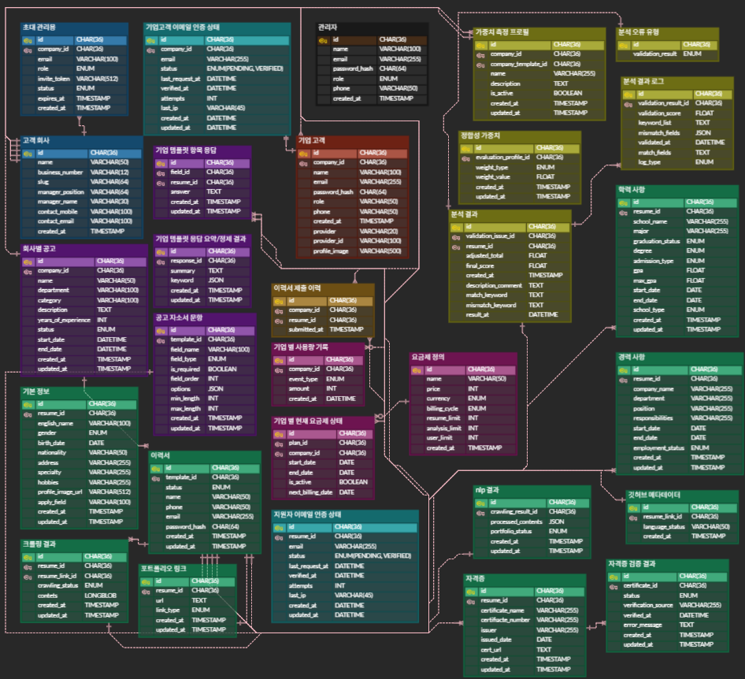

</details>
<br>


## 6. 테이블 명세서

[테이블 명세서](https://docs.google.com/spreadsheets/d/1rohN4_s3YLDfYMuYjYqJgqTp1kEWab0ajzBy4B2j8YY/edit?usp=sharing)


<br>

## 7. API 명세서

[API 명세서](https://www.notion.so/API-2455605940ec80d0a6cecfb101029e19?source=copy_link)

<br/>


## 8. 테스트 결과서

[백엔드 테스트 결과서](https://www.notion.so/2775605940ec801286d6f888af3e93d2?v=2775605940ec80ba931c000c1fcfe3ed)

[단위 테스트 결과서](https://www.notion.so/292819b5e8c680959006d4e288e86acd?source=copy_link)


<br>

## 9. CI/CD 절차

### 9-1. 목표

<br>

코드 배포 자동화, 안정적 버전관리, 서비스 무중단 운영
<br>

### 9-2. 기술 스택 및 선택 이유

<details>
<summary>세부 내용</summary>

| **구분**           | **기술**               | **선택 이유**                                                                                                                                   |
| ---------------- | -------------------- | ------------------------------------------------------------------------------------------------------------------------------------------- |
| **컨테이너 오케스트레이션** | **Kubernetes (k8s)** | - Docker 컨테이너의 자동 배포 및 스케일링<br>- Pod 단위 격리로 서비스 안정성 확보<br>- 무중단 롤링 업데이트 및 헬스체크 지원                     |
| **CI 서버**        | **Jenkins**          | - 오픈소스 CI 툴로 커스터마이징 용이<br>- Spring Boot, Gradle, Docker와 높은 호환성<br>- 파이프라인 스크립트를 통한 유연한 빌드/테스트 자동화<br>- GitHub Webhook 기반 자동 빌드 트리거 가능      |
| **CD 툴**         | **ArgoCD**           | - GitOps 방식의 CD 지원 (Git 상태 = 실제 배포 상태)<br>- k8s 리소스 변경 자동 감지 및 동기화<br>- UI를 통한 배포 상태 모니터링 및 롤백 지원<br>- Jenkins와의 연동으로 배포 승인/자동화 파이프라인 구성 가능 |
</details>


### 9-3. CI/CD 파이프라인 절차

#### (1) CI 단계 (Continuous Integration) – Jenkins

<details>
<summary>세부 내용</summary>

1. 개발자가 코드 푸시 → GitHub Webhook Trigger  
 - develop, main 브랜치 기준으로 자동 감지

2. Jenkins Pipeline 실행  
 - Jenkinsfile 스크립트 기반  
 - Gradle 빌드 및 단위 테스트 수행  
     `./gradlew clean build`

3. 도커 이미지 생성  
 - DockerFile 기반 이미지 빌드  
 - 이미지 태그:  
     - java 서버: `viroovr/specguard-api:(jenkins job id)`  
     - python 서버: `viroovr/specguard-nlp:(jenkins job id)`  
     - frontend 서버: `kimeodml/specguard-frontend:(jenkins build no)`

4. 도커 허브 푸시  
 - Jenkins Credential을 이용해 DockerHub로 이미지 업로드

</details>

#### (2) CD 단계 (Continuous Deployment) – ArgoCD + Kubernetes <br>

<details>
<summary>세부 내용</summary>

1. **ArgoCD가 GitOps Repository 모니터링**
 - GitHub Repository: [specguard-k8s-manifests](https://github.com/kimeodml/specguard-k8s-manifests)
 - 모니터링 디렉토리 구조:
     ```
     specguard-k8s-manifests/
     ├── specguard-backend/
     │   ├── java/
     │   └── python/
     └── specguard-frontend/
     ```
 - 각 서비스별로 Deployment, Service, Ingress 매니페스트 관리
 - ArgoCD는 각 디렉토리를 개별 Application으로 등록하여 자동 동기화

2. 새로운 이미지 태그 감지 시 자동 배포 <br>
  - ArgoCD가 k8s 클러스터에 배포 상태를 동기화 <br>
  - Deployment의 image 필드 변경 감지 → Rolling Update 수행 <br>
3. 배포 검증 및 롤백 <br>
  - ArgoCD UI에서 Pod 상태, Sync 상태 확인 <br>
  - 실패 시 이전 리비전으로 원클릭 롤백 가능 <br>
4. Argo CD 레포
</details>

### 9-4. 장단점 분석

<details>
<summary>세부 내용</summary>

| **구분**         | **장점**                                                             | **단점**                                        |
| -------------- | ------------------------------------------------------------------ | --------------------------------------------- |
| **Kubernetes** | - 자동 복구(Self-healing)<br>- 무중단 배포(Rolling Update)<br>- 클라우드 친화적 구조 | - 초기 세팅 복잡<br>- YAML 관리량 많음                   |
| **Jenkins**    | - 플러그인 다양성<br>- 완전한 빌드 자동화<br>- Webhook 실시간 트리거 가능                 | - UI/구성 복잡<br>- 별도 관리 서버 필요                   |
| **ArgoCD**     | - GitOps 기반 선언적 배포<br>- 롤백 용이<br>- 실시간 배포 모니터링                     | - 초기 설정 난이도 높음<br>- Git 상태와 실제 배포 불일치 시 혼란 가능 |

</details>


### 9-5. 전체 아키텍처 흐름 <br>
  [개발자] → GitHub → Jenkins (CI) <br>
  → Docker Build & Push → GitOps Repo 업데이트 <br>
  → ArgoCD (CD) → Kubernetes Cluster 배포
<br>

### 9-6. 코드 <br>
<ol>
<li>Pipe Line Code</li>
<details>
<summary>Backend PipeLine</summary>

```groovy
pipeline {
    agent {
        kubernetes {
            yaml '''
            apiVersion: v1
            kind: Pod
            metadata:
                name: jenkins-agent
            spec:
                containers:
                -   name: gradle
                    image: gradle:8.5-jdk21-alpine
                    command: ["cat"]
                    tty: true
                -   name: docker
                    image: docker:27.2.0-alpine3.20
                    command: ["cat"]
                    tty: true
                    volumeMounts:
                    -   name: docker-socket
                        mountPath: "/var/run/docker.sock"
                volumes:
                -   name: docker-socket
                    hostPath:
                        path: "/var/run/docker.sock"
            '''
        }
    }

    environment {
        JAVA_IMAGE_NAME = 'viroovr/specguard-api'
        PYTHON_IMAGE_NAME = 'viroovr/specguard-nlp'
        JAVA_DIR = 'be18-specguard-backend/backend'
        PYTHON_DIR = 'be18-specguard-backend/python-server'

        DISCORD_WEBHOOK_CREDENTIALS_ID = 'specguard-backend-webhook'
        DOCKER_CREDENTIALS_ID = 'dockerhub-access'
    }

    stages {
        stage('Detect Changes') {
            steps {
                script {
                    // 현재 커밋과 이전 커밋(HEAD~1) 간의 변경 파일을 가져온다.
                    def changedFiles = sh(script: 'git diff --name-only HEAD~1', returnStdout: true).trim().split("\n")

                    // 전체 배열을 줄바꿈으로 출력
                    echo "Changed files:\n${changedFiles.join('\n')}"

                    // 현재 커밋 SHA 추출 (짧은 형태)
                    env.GIT_COMMIT = sh(script: "git rev-parse --short HEAD", returnStdout: true).trim()

                    echo "GIT_COMMIT : ${env.GIT_COMMIT}"

                    // 환경 변수 동적 설정
                    env.SHOULD_BUILD_JAVA = changedFiles.any { it.startsWith(JAVA_DIR) } ? "true" : "false"
                    env.SHOULD_BUILD_PYTHON  = changedFiles.any { it.startsWith(PYTHON_DIR) } ? "true" : "false"

                    echo "SHOULD_BUILD_JAVA : ${SHOULD_BUILD_JAVA}"
                    echo "SHOULD_BUILD_PYTHON : ${SHOULD_BUILD_PYTHON}"
                }
            }
        }

        stage('Docker Login') {
            steps {
                container('docker') {
                    sh 'docker logout || true'

                    withCredentials([usernamePassword(
                        credentialsId: DOCKER_CREDENTIALS_ID,
                        usernameVariable: 'DOCKER_USERNAME',
                        passwordVariable: 'DOCKER_PASSWORD'
                    )]) {
                        sh 'echo $DOCKER_PASSWORD | docker login -u $DOCKER_USERNAME --password-stdin'
                    }
                }
            }
        }

        // ===============================
        // 단위 테스트 Stage 추가
        // ===============================
        stage('Unit Test (Java)') {
            when {
                expression { env.SHOULD_BUILD_JAVA == "true" }
            }
            steps {
                container('gradle') {
                    dir(JAVA_DIR) {
                        sh 'chmod +x gradlew'
                        sh './gradlew clean test'
                    }
                }
            }
        }

        stage('Java Image Build & Push') {
            when {
                expression {
                    return env.SHOULD_BUILD_JAVA == "true"
                }
            }

            steps {
                container('docker') {
                    dir(JAVA_DIR) {
                        script {
                        def buildNumber = "${env.GIT_COMMIT}"

                        withEnv(["DOCKER_IMAGE_VERSION=${buildNumber}"]) {
                                sh 'docker -v'
                                sh 'echo $JAVA_IMAGE_NAME:$DOCKER_IMAGE_VERSION'
                                sh 'docker build --no-cache -t $JAVA_IMAGE_NAME:$DOCKER_IMAGE_VERSION ./'
                                sh 'docker image inspect $JAVA_IMAGE_NAME:$DOCKER_IMAGE_VERSION'
                                sh 'docker push $JAVA_IMAGE_NAME:$DOCKER_IMAGE_VERSION'
                            }
                        }
                    }
                }
            }
        }

        stage('Python Image Build & Push') {
            when {
                expression {
                    return env.SHOULD_BUILD_PYTHON == "true"
                }
            }

            steps {
                container('docker') {
                    dir(PYTHON_DIR) {
                        script {
                            def buildNumber = "${env.GIT_COMMIT}"

                            withEnv(["DOCKER_IMAGE_VERSION=${buildNumber}"]) {
                                sh 'docker -v'
                                sh 'echo $PYTHON_IMAGE_NAME:$DOCKER_IMAGE_VERSION'
                                sh 'docker build --no-cache -t $PYTHON_IMAGE_NAME:$DOCKER_IMAGE_VERSION ./'
                                sh 'docker image inspect $PYTHON_IMAGE_NAME:$DOCKER_IMAGE_VERSION'
                                sh 'docker push $PYTHON_IMAGE_NAME:$DOCKER_IMAGE_VERSION'
                            }
                        }
                    }
                }
            }
        }

        stage('Trigger specguard-backend-manifests job') {
            steps {
                script {
                    def buildNumber = "${env.GIT_COMMIT}"

                    withEnv(["DOCKER_IMAGE_VERSION=${buildNumber}"]) {
                        build job: 'specguard-backend-manifests',
                        parameters: [
                            string(name: 'DOCKER_IMAGE_VERSION', value: buildNumber),
                            string(name: 'DID_BUILD_JAVA', value: "${env.SHOULD_BUILD_JAVA}"),
                            string(name: 'DID_BUILD_PYTHON', value: "${env.SHOULD_BUILD_PYTHON}")
                        ],
                        wait: true
                    }
                }
            }
        }
    }

    post {
        always {
            withCredentials([string(
                credentialsId: DISCORD_WEBHOOK_CREDENTIALS_ID, 
                variable: 'DISCORD_WEBHOOK_URL'
            )]) {
                discordSend description: """
                💡 **SpecGuard Backend CI/CD 알림**
                🔹 Job : ${env.JOB_NAME}
                🔹 Build : ${currentBuild.displayName}
                🔹 Commit : ${env.GIT_COMMIT}
                🔹 결과 : ${currentBuild.currentResult}
                🔹 실행 시간 : ${currentBuild.duration / 1000}s
                """,
                result: currentBuild.currentResult,
                title: "SpecGuard BE Pipeline : ${env.GIT_COMMIT}",
                webhookURL: "${DISCORD_WEBHOOK_URL}"
            }
        }
    }
}

```
</details>

<details>
<summary>Frontend PipeLine</summary>

```groovy
pipeline {
    agent {
        kubernetes {
            yaml '''
            apiVersion: v1
            kind: Pod
            metadata:
              name: jenkins-agent
            spec:
              containers:
              - name: node
                image: node:20-alpine
                command:
                - cat
                tty: true
              - name: docker
                image: docker:28.5.1-cli-alpine3.22
                command:
                - cat
                tty: true
                volumeMounts:
                - mountPath: "/var/run/docker.sock"
                  name: docker-socket
              volumes:
              - name: docker-socket
                hostPath:
                  path: "/var/run/docker.sock"
            '''
        }
    }

    environment {
        DOCKER_IMAGE_NAME_FE = 'kimeodml/specguard-frontend'
        DOCKER_CREDENTIALS_ID = 'dockerhub-access'
        DISCORD_WEBHOOK_CREDENTIALS_ID = 'specguard-frontend-webhook'
    }

    stages {
        stage('Detect Changes') {
            steps {
                script {
                    def changedFiles = sh(script: 'git diff --name-only HEAD~1', returnStdout: true).trim().split("\n")

                    echo "Changed files:\n${changedFiles.join('\n')}"

                    // 현재 커밋 SHA 추출 (짧은 형태)
                    env.GIT_COMMIT = sh(script: "git rev-parse --short HEAD", returnStdout: true).trim()

                    echo "GIT_COMMIT : ${env.GIT_COMMIT}"

                    env.SHOULD_BUILD_APP = changedFiles.any { it.startsWith("be18-specguard-frontend/") } ? "true" : "false"

                    echo "env.SHOULD_BUILD_APP: ${env.SHOULD_BUILD_APP}"
                }
            }
        }

        stage('Frontend Build') {
            steps {
                container('node') {
                    dir('be18-specguard-frontend') {
                        sh '''
                            npm install
                            npm run build
                        '''
                    }
                }
            }
        }

        stage('Image Build & Push - Frontend') {
            when {
                expression {
                    return env.SHOULD_BUILD_APP == "true"
                }
            }
            steps {
                container('docker') {
                    script {
                        def buildNumber = "${env.GIT_COMMIT}"

                        sh 'docker logout'

                        withCredentials([usernamePassword(
                            credentialsId: DOCKER_CREDENTIALS_ID,
                            usernameVariable: 'DOCKER_USERNAME',
                            passwordVariable: 'DOCKER_PASSWORD'
                        )]) {
                            sh 'echo $DOCKER_PASSWORD | docker login -u $DOCKER_USERNAME --password-stdin'
                        }

                        withEnv(["DOCKER_IMAGE_VERSION=${buildNumber}"]) {
                            dir('be18-specguard-frontend') {
                                sh 'docker -v'
                                sh 'echo $DOCKER_IMAGE_NAME_FE:$DOCKER_IMAGE_VERSION'
                                sh 'docker build --no-cache -t $DOCKER_IMAGE_NAME_FE:$DOCKER_IMAGE_VERSION ./'
                                sh 'docker image inspect $DOCKER_IMAGE_NAME_FE:$DOCKER_IMAGE_VERSION'
                                sh 'docker push $DOCKER_IMAGE_NAME_FE:$DOCKER_IMAGE_VERSION'
                            }
                            
                        }
                    }
                }
            }
        }

        stage('Trigger specguard-frontend-manifests') {
            steps {
                script {
                    def buildNumber = "${env.GIT_COMMIT}"

                    withEnv(["DOCKER_IMAGE_VERSION=${buildNumber}"]) {
                        build job: 'specguard-frontend-manifests', 
                        parameters: [
                            string(name: 'DOCKER_IMAGE_VERSION', value: "${DOCKER_IMAGE_VERSION}"),
                            string(name: 'DID_BUILD_APP', value: "${env.SHOULD_BUILD_APP}")
                        ], 
                        wait: true
                    }
                    
                }
            }
        }
    }

    post {
        always {
            withCredentials([string(
                credentialsId: DISCORD_WEBHOOK_CREDENTIALS_ID,
                variable: 'DISCORD_WEBHOOK_URL'
            )]) {
                discordSend description: """
                💡 **SpecGuard Frontend CI/CD 알림**
                🔹 Job : ${env.JOB_NAME}
                🔹 Build : ${currentBuild.displayName}
                🔹 Commit : ${env.GIT_COMMIT}
                🔹 결과 : ${currentBuild.currentResult}
                🔹 실행 시간 : ${currentBuild.duration / 1000}s
                """,
                result: currentBuild.currentResult,
                title: "SpecGuard FE Pipeline : ${env.GIT_COMMIT}",
                webhookURL: "${DISCORD_WEBHOOK_URL}"
            }

        }
    }
}
```

</details>

<li>Manifest Code</li>
<details>
<summary>Backend Manifest</summary>

```groovy
pipeline {
    agent any

    parameters {
        string(name: 'DOCKER_IMAGE_VERSION', defaultValue: '', description: 'Docker Image Version')
        string(name: 'DID_BUILD_JAVA', defaultValue: '', description: 'Java Builded boolean')
        string(name: 'DID_BUILD_PYTHON', defaultValue: '', description: 'Python Builded boolean')
    }

    
    stages {
        stage('Checkout Main Branches') {
            steps {
                sh 'git checkout main'
                echo "DOCKER_IMAGE_VERSION: ${params.DOCKER_IMAGE_VERSION}"
                echo "DID_BUILD_JAVA: ${params.DID_BUILD_JAVA}"
                echo "DID_BUILD_PYTHON: ${params.DID_BUILD_PYTHON}"
            }
        }

        stage('update Python deploy.yaml') {
            when {
                expression {
                    return params.DID_BUILD_PYTHON == "true"
                }
            }

            steps {
                // Jenkins 파이프라인에서 작업 디렉터리를 변경할 때 사용한다.
                dir('specguard-backend/python') {
                    sh 'pwd'
                    sh 'ls -al'
                    echo "Received Docker Image Version : ${params.DOCKER_IMAGE_VERSION}"
                    sh 'git checkout main'
                    sh "sed -i 's|viroovr/specguard-nlp:.*|viroovr/specguard-nlp:${params.DOCKER_IMAGE_VERSION}|g' deploy.yaml"
                    sh 'cat deploy.yaml'
                }
            }
        }

        stage('update Java deploy.yaml') {
            when {
                expression {
                    return params.DID_BUILD_JAVA == "true"
                }
            }

            steps {
                // Jenkins 파이프라인에서 작업 디렉터리를 변경할 때 사용한다.
                dir('specguard-backend/java') {
                    sh 'pwd'
                    sh 'ls -al'
                    echo "Received Docker Image Version : ${params.DOCKER_IMAGE_VERSION}"
                    sh 'git checkout main'
                    sh "sed -i 's|viroovr/specguard-api:.*|viroovr/specguard-api:${params.DOCKER_IMAGE_VERSION}|g' deploy.yaml"
                    sh 'cat deploy.yaml'
                }
            }
        }

        stage('Commit & Push') {
            when {
                expression {
                    return params.DID_BUILD_PYTHON == "true" || params.DID_BUILD_JAVA == "true"
                }
            }

            steps {
                sh 'git config --list'
                sh 'git config user.name "jenkins"'
                sh 'git config user.email "jenkins@beyond.com"'

            // 변경된 파일 있는지 확인
            script {
                def changes = sh(script: "git status --porcelain", returnStdout: true).trim()
                if (changes) {
                    echo "🔹 변경 사항 감지됨 → 커밋 및 푸시 실행"

                    sh 'git add .'
                    sh "git commit -m '[Auto] update image version ${params.DOCKER_IMAGE_VERSION}'"
                    
                    sshagent(['specguard-k8s-manifests']) {
                        sh 'git push origin main'
                    }
                } else {
                    echo "⚪ 변경 사항 없음 → 커밋/푸시 생략"
                }
            }
        }
    }
    }
}

```
</details>

<details>
<summary>Frontend Manifest</summary>

```groovy
pipeline {
    agent any

    parameters {
        string(name: 'DOCKER_IMAGE_VERSION', defaultValue: '', description: 'Docker Image Version')
        string(name: 'DID_BUILD_APP', defaultValue: '', description: 'Did Build APP')
    }

    stages {
        stage('Checkout Main Branches') {
            steps {
                sh 'git checkout main'
                echo "DOCKER_IMAGE_VERSION: ${params.DOCKER_IMAGE_VERSION}"
            }
        }

        stage('update Vue deploy.yaml') {
            steps {
                // Jenkins 파이프라인에서 작업 디렉터리를 변경할 때 사용한다.
                dir('specguard-frontend') {
                    sh 'pwd'
                    sh 'ls -al'
                    echo "Received Docker Image Version : ${params.DOCKER_IMAGE_VERSION}"
                    sh "sed -i 's|kimeodml/specguard-frontend:.*|kimeodml/specguard-frontend:${params.DOCKER_IMAGE_VERSION}|g' deploy.yaml"
                    sh 'cat deploy.yaml'
                }
            }
        }

        stage('Commit & Push') {
            when {
                expression {
                    return params.DID_BUILD_APP == "true"
                }
            }
            
            steps {
                sh 'git config user.name "jenkins"'
                sh 'git config user.email "jenkins@beyond.com"'

                // 변경된 파일 있는지 확인
                script {
                    def changes = sh(script: "git status --porcelain", returnStdout: true).trim()
                    if (changes) {
                        echo "🔹 변경 사항 감지됨 → 커밋 및 푸시 실행"

                        sh 'git add .'
                        sh "git commit -m '[Auto] update image version ${params.DOCKER_IMAGE_VERSION}'"
                        
                        sshagent(['specguard-k8s-manifests']) {
                            sh 'git push origin main'
                        }
                    } else {
                        echo "⚪ 변경 사항 없음 → 커밋/푸시 생략"
                    }
                }
            }
        }
    }
}
```

</details>

</ol>

### 9-7. 결과 <br>

<details>
<summary>Backend</summary>

<ol> 
<li>CI Job</li>

<details>

[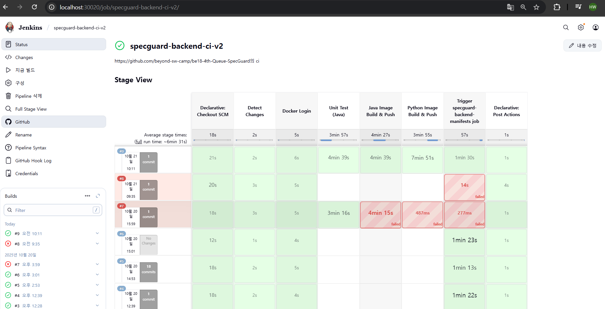](https://drive.google.com/file/d/1AD4i5wiX06Rrx-VUvl_M2WNxuPzg9Qbk/view?usp=drive_link)
</details>

<li>Manifest</li>

<details>

[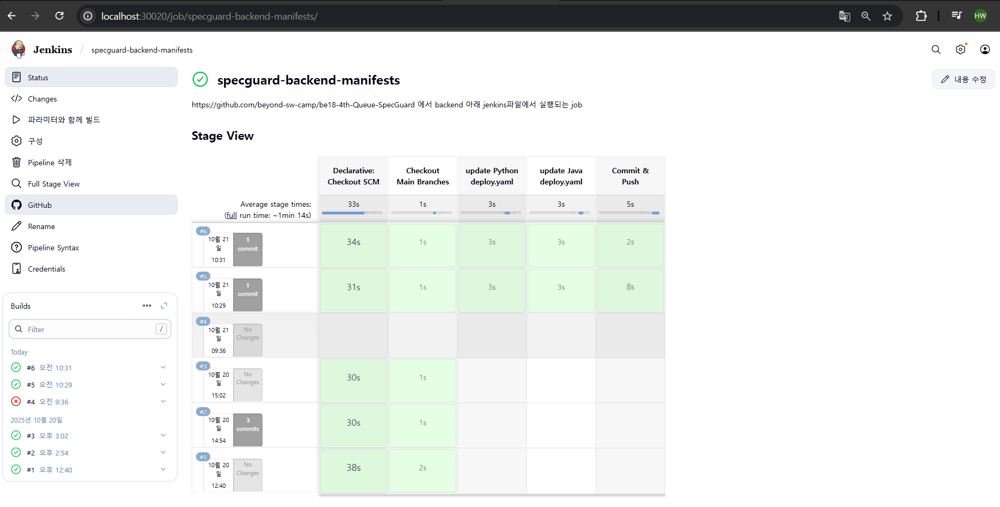](https://drive.google.com/file/d/1q8ckzNxokM1mwmGZNm3i2PZw4gf9Jeek/view?usp=drive_link)

</details>

<li>ArgoCD</li>

<details>

- Synchronization

[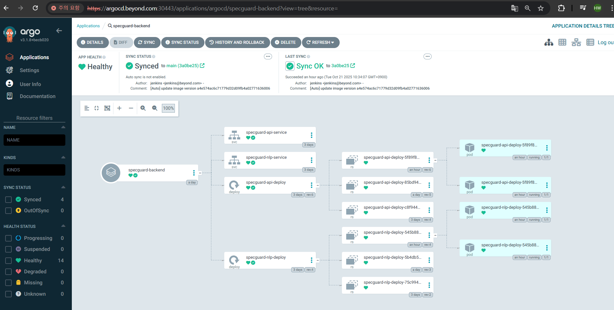](https://drive.google.com/file/d/1EdJWIISSqq8YA9R-d4qaMKZ4HF8zOa9b/view?usp=drive_link)

- Logs

[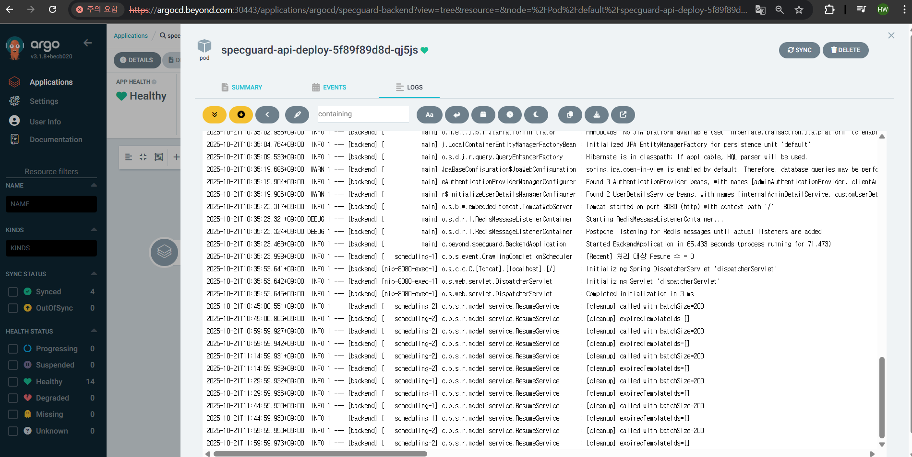](https://drive.google.com/file/d/18NsASmSKN77Ar55w7YD4bxl67-HwAn4_/view?usp=drive_link)

</details>

<li>Discord</li>
<details>

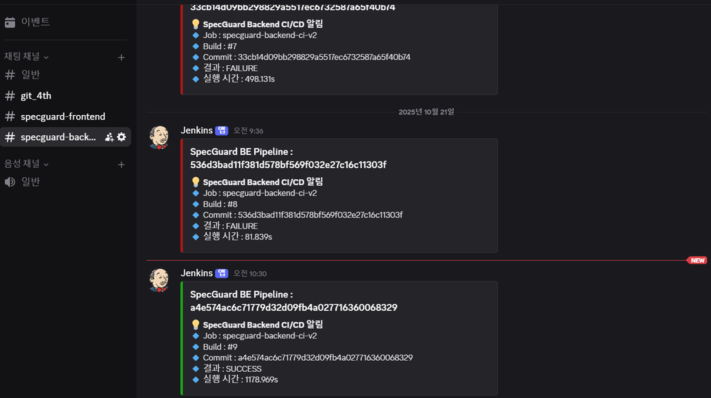

</details>
</ol>
</details>

<details>
<summary>Frontend</summary>

<ol> 
<li>CI Job

<details>

[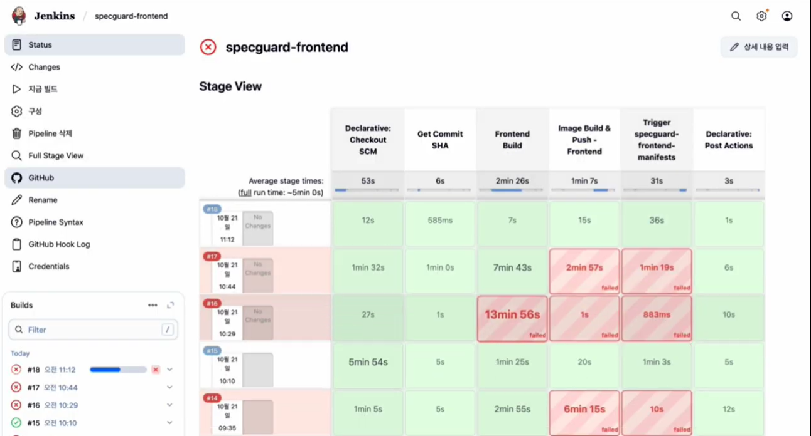](https://drive.google.com/file/d/191bZVFRl94CjL3hz2vczJ86swee5sZ3H/view?usp=drive_link)
</details>
</li>

<li>Manifest</li>

<details>

[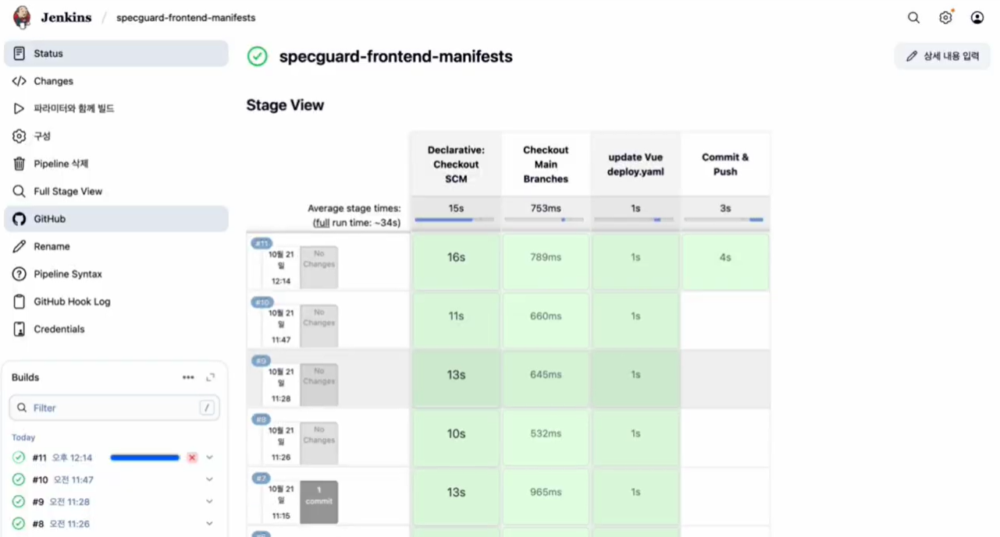](https://drive.google.com/file/d/1RhtZhgK1oD2XWz27hbbgomWsAfNBBtad/view?usp=drive_link)


</details>

<li>ArgoCD</li>

<details>
<p>Synchronization</p>

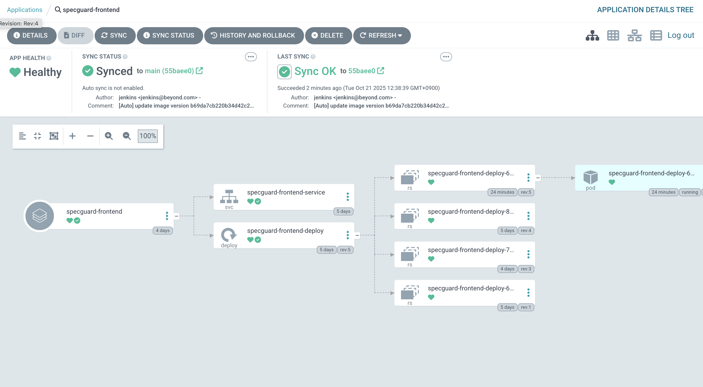


<p>Logs</p>

[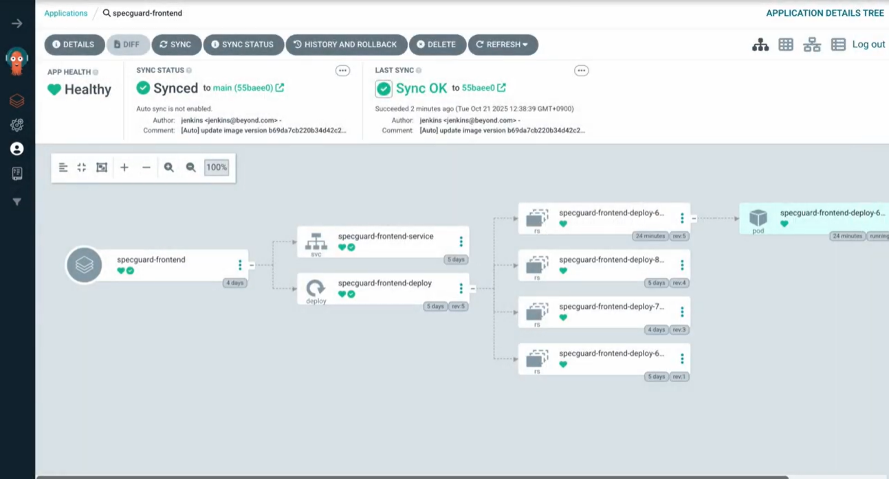](https://drive.google.com/file/d/1eLUiSvpdv8ysXtmRdQa4Tpk8ateYko01/view?usp=drive_link)

</details>

<li>Discord</li>
<details>

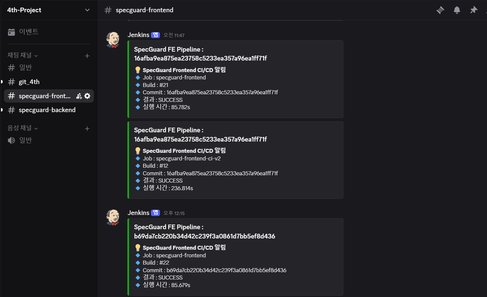

</details>

</ol>
</details>


### 9-8. 결론 <br>
  본 CI/CD 구조는 개발-테스트-배포의 전 과정을 자동화하여 <br>
    - 배포시간 단축, 버전 추적성 강화, 장애 발생 시 빠른 롤백 을 가능하게 한다.

    
<br>


## 10. 향후 개선 계획

1. CI 시간 단축

2. 배포 방식 Blue-Green 등 결정

3. 환경 변수 관리

4. Python, Vue Unit Test 추가


<br/>

## 11. 회고록
|   이 름  | 내용 |
|--------|--------|
| 서현원 | CI/CD 개발에 대해 평소 궁금증이 많았고 직접 경험해보고 싶은 마음이 컸습니다. 이번 프로젝트에서 팀원들과 함께 파이프라인을 개발하며 이러한 궁금증을 직접 해결할 수 있었고, 현업에서의 CI/CD 전체 흐름을 큰 그림으로 이해할 수 있었습니다. 덕분에 앞으로 DevOps 엔지니어들과 원활히 소통하거나, 필요시 직접 DevOps 업무를 수행할 자신감이 생겼습니다. 또한 Docker와 Kubernetes를 활용한 환경 구축과 운영에도 적극적으로 적용할 수 있는 역량을 키울 수 있었습니다.  |
| 김대의 | CI/CD의 경우 vercel 밖에 경험해 본적이 없어서 젠킨스로 진행하는 CI/CD를 해보고 싶다는 생각을 자주 했었습니다. 이번 기회에 프론트엔드의 파이프라인을 구축해보면서 자동 배포의 효율성을 체감해 볼 수 있었고 파이널 때는 github-action으로도 활용해 보고 싶다는 생각이 들었습니다.  |
| 김택곤 | Jenkins와 ArgoCD, Kubernetes를 이용해 CI/CD 파이프라인을 구축하면서 개발-테스트-배포 흐름을 자동화할 수 있었다. 수동으로 진행하던 빌드와 배포 과정을 자동화하자 시간 낭비가 줄고 오류 발생률이 크게 낮아졌다. Jenkins 파이프라인 설계 단계에서 환경 변수와 빌드 트리거 관리가 가장 까다로웠지만, 구조를 표준화한 뒤에는 유지보수가 훨씬 수월해졌다. 이번 구축을 통해 자동화의 중요성을 체감했고, 코드 품질과 배포 효율을 동시에 개선하는 기반을 마련할 수 있었다. |
| 육세윤 | 이번 CI/CD 프로젝트를 통해 코드 변경이 자동으로 빌드·배포되는 파이프라인의 중요성과 효율성을 깊이 체감했다. 지속적 통합과 배포를 직접 구현하며 개발 생산성과 협업 안정성을 동시에 확보하는 DevOps를 배울 수 있는 귀중한 기회였다.   |
| 이인화 | Jenkins 파이프라인을 구성하면서 빌드 단계와 배포 단계가 어떤 순서로 진행되는지, 또 ArgoCD가 어떻게 실제 클러스터 상태를 지속적으로 모니터링하고 동기화하는지 확인할 수 있었습니다. 이 과정을 통해 자동화의 핵심은 단순히 시간을 줄이는 것이 아니라 안정적이고 일관된 배포 흐름을 만드는 것이라는 점을 배웠습니다. |
